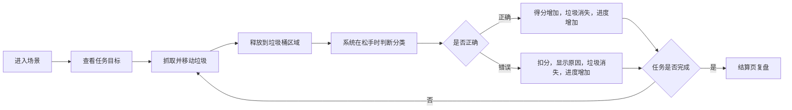

# ParkClean VR V0.3 PRD

## 1. 文档定位

本文档描述 ParkClean VR 垃圾分类小游戏 V0.3 阶段的产品需求。V0.3 的核心目标不是一次性完成完整 VR 项目，而是先跑通一个键盘鼠标可玩的 Unity MVP，为后续 VR 适配保留清晰接口。

当前项目由“清扫社区”Demo 重构而来。原 Demo 已有基础场景、垃圾资源、点击清理、倒计时和胜负面板，但玩法仍停留在“清扫/收集”。V0.3 需要升级为“观察垃圾、抓取垃圾、判断类别、投放垃圾桶、获得反馈、结算复盘”的垃圾分类闭环。

## 2. 当前阶段结论

| 项目 | V0.3 决策 |
| --- | --- |
| 当前目标 | 键盘鼠标可玩的垃圾分类 MVP |
| VR 适配 | 本阶段不做，只预留接口 |
| 首个场景 | 校园食堂或社区投放点，小范围可玩 |
| 操作方式 | 桌面端移动与视角控制、抓取和释放 |
| 垃圾数量 | 12 个模型已落位，优先保证 8 个基础垃圾可玩 |
| 垃圾桶 | 四分类垃圾桶已落位 |
| 数据记录 | 本地当轮统计，不做联网 |
| 开发方式 | 三人分模块开发，PR 审核后合入 |

## 3. 产品目标

### 3.1 用户体验目标

- 玩家能在非 VR 环境中完成一轮垃圾分类。
- 玩家能通过模型外观判断垃圾类型。
- 玩家投放后能立即知道对错。
- 玩家投错时能看到正确分类和原因。
- 玩家不需要重复处理同一件垃圾，单件垃圾只判定一次。
- 玩家结束后能看到正确率、用时和错误复盘。

### 3.2 项目展示目标

- 形成可演示、可答辩、可继续迭代的 MVP。
- 体现“VR 与可持续发展”的主题，即通过沉浸式和具身交互辅助环保教育。
- 让开发范围稳定，避免多人开发失控。
- 为后续 VR 手柄抓取、空间 UI、震动反馈和低眩晕体验留出结构。

### 3.3 技术目标

- 将“点击清扫计数”重构为“垃圾属性 + 垃圾桶判定”。
- 分类逻辑、键鼠交互、任务 UI 分离。
- 不把输入方式和分类规则绑定死。
- 不把 UI、统计、抓取、判定全部堆在 `Player.cs` 或 `Garbage.cs` 中。

## 4. 目标用户与场景

| 用户 | 需求 | V0.3 体现方式 |
| --- | --- | --- |
| 学生 | 用低门槛方式学习垃圾分类 | 食堂/社区生活场景、常见垃圾 |
| 环保教育展示对象 | 快速理解项目价值 | 3 分钟内完成一轮体验 |
| 项目评审者 | 看到完整交互闭环 | 开始、投放、反馈、结算全部可见 |
| 后续 VR 使用者 | 需要自然交互和低眩晕 | V0.3 先控制场景范围和交互复杂度 |

## 5. MVP 核心流程

## 6. V0.3 功能范围

### 6.1 必须实现

| 模块 | 必须能力 |
| --- | --- |
| 场景 | 玩家能进入一个可操作场景，看到垃圾、垃圾桶和基本环境 |
| 垃圾模型 | 12 个模型已导入，至少 8 个进入可玩流程 |
| 垃圾桶 | 四类垃圾桶可单独判定：可回收物、有害垃圾、厨余垃圾、其他垃圾 |
| 键鼠交互 | 桌面端视角控制、抓取、持有、释放 |
| 分类判定 | 垃圾在松手时基于当前重叠垃圾桶区域判断正误 |
| 错误处理 | 投错后提示原因，垃圾直接消失并计入进度 |
| 任务流程 | 倒计时、目标数量、完成/失败判断 |
| UI 反馈 | 正确提示、错误提示、进度、得分或正确数 |
| 结算复盘 | 显示成功/失败、用时、正确率、错误列表 |

### 6.2 本阶段不做

| 不做内容 | 原因 |
| --- | --- |
| VR 头显和手柄适配 | 有单独人员后续负责，本阶段先跑通键鼠版本 |
| 手势识别 | 设备适配成本高，不影响 MVP 闭环 |
| 多场景 | 先保证一个场景稳定 |
| 连击、成就、排行榜 | 非核心闭环，容易扩大范围 |
| 联网数据上传 | V0.3 只做本地当轮统计 |
| 复杂投掷物理 | 先稳定抓取/释放/判定 |
| 高级动画与粒子效果 | 先用清晰 UI 和简单反馈替代 |

## 7. 已落位资产

### 7.1 垃圾模型

目录：`Assets/Art/GarbageItems/`

| 中文名 | 分类 | 文件名 | 优先级 |
| --- | --- | --- | --- |
| 塑料瓶 | Recyclable | `garbage_plastic_bottle.glb` | 基础 |
| 纸箱 | Recyclable | `garbage_cardboard_box.glb` | 基础 |
| 易拉罐 | Recyclable | `garbage_aluminum_can.glb` | 补充 |
| 剩饭 | Kitchen | `garbage_leftover_rice.glb` | 基础 |
| 果皮 | Kitchen | `garbage_fruit_peel.glb` | 基础 |
| 菜叶 | Kitchen | `garbage_vegetable_leaf.glb` | 补充 |
| 旧电池 | Hazardous | `garbage_battery.glb` | 基础 |
| 过期药品 | Hazardous | `garbage_expired_medicine.glb` | 基础 |
| 灯管 | Hazardous | `garbage_lamp_tube.glb` | 补充 |
| 污染纸巾 | Other | `garbage_dirty_tissue.glb` | 基础 |
| 奶茶杯 | Other | `garbage_milk_tea_cup.glb` | 基础 |
| 油污外卖盒 | Other | `garbage_oily_takeout_box.glb` | 补充 |

### 7.2 垃圾桶模型

目录：`Assets/Art/TrashBins/`

| 中文名 | 分类 | 文件名 |
| --- | --- | --- |
| 可回收垃圾桶 | Recyclable | `bin_recyclable_blue.glb` |
| 有害垃圾桶 | Hazardous | `bin_hazardous_red.glb` |
| 厨余垃圾桶 | Kitchen | `bin_kitchen_green.glb` |
| 其他垃圾桶 | Other | `bin_other_gray.glb` |

## 8. 核心功能需求

### 8.1 垃圾物品

每个垃圾物品需要配置：

- `itemId`：与资源文件名一致，例如 `garbage_plastic_bottle`。
- `itemName`：中文名，例如“塑料瓶”。
- `category`：正确分类。
- `wrongReason`：错误解释文案。
- 初始位置和旋转，用于场景初始化或重新开始。
- 状态：`Idle`、`Held`、`Completed`。

无论正确或错误，物品在判定后都进入 `Completed`，不能重复抓取、重复判定或重复计分。

### 8.2 垃圾桶与投放区域

每个垃圾桶需要：

- 配置自身分类。
- 有可见模型。
- 有桶口或桶前方 `DropZone`。
- `DropZone` 使用 Trigger Collider。
- 判断时只比较垃圾分类和垃圾桶分类。

V0.3 对判定区域应适度宽容，降低操作挫败感。

### 8.3 桌面端交互

操作方式：

- 视角控制。
- 抓取和释放。
- 抓取时垃圾跟随摄像机前方固定位置。
- 松手时如果与多个垃圾桶区域重叠，只取最近的一个做判定。
- 松手时完成一次性分类判定。

V0.3 不要求真实抛掷，不要求物理手感完全真实。

### 8.4 任务与 UI

游戏中 UI 至少显示：

- 倒计时。
- 当前进度，例如 `3/8` 或 `3/12`。
- 得分。
- 当前反馈提示。

结算页至少显示：

- 成功或失败。
- 用时。
- 得分。
- 正确率。
- 错误次数。
- 错误物品列表。
- 重玩按钮。

### 8.5 统计数据

V0.3 只记录当轮数据：

| 字段 | 用途 |
| --- | --- |
| `totalTarget` | 本轮目标数量 |
| `completedCount` | 已完成判定数量 |
| `correctCount` | 正确次数 |
| `wrongCount` | 错误次数 |
| `elapsedTime` | 用时 |
| `wrongAttempts` | 错误记录列表 |

错误记录至少包含：物品名、正确分类、错误投放分类、错误原因。

## 9. 三名开发分工

| 开发 | 负责内容 | 主要目录 |
| --- | --- | --- |
| 开发 A | 分类核心：垃圾、垃圾桶、DropZone、分类事件 | `Assets/Scripts/Gameplay/` |
| 开发 B | 键鼠交互：移动、视角、选中、抓取、释放 | `Assets/Scripts/Player/`、`Assets/Scripts/Interaction/` |
| 开发 C | 任务 UI：倒计时、反馈、结算、统计 | `Assets/Scripts/Core/`、`Assets/Scripts/UI/`、`Assets/Scripts/Analytics/` |

详细任务见：

- `docs/plan/开发A-核心分类逻辑与垃圾桶判定任务.md`
- `docs/plan/开发B-键鼠交互与玩家控制任务.md`
- `docs/plan/开发C-任务流程UI反馈与结算统计任务.md`
- `docs/plan/V0.3-开发协作规范.md`

## 10. 依赖关系

开发 A 需要先提供接口骨架：

- `WasteCategory`
- `GarbageItem`
- `TrashBin`
- `DropZone`
- `ClassificationResult`
- `ClassificationEvents`

开发 B 和开发 C 不需要等待 A 完成所有细节，但需要基于 A 的接口开发。

开发 B 依赖：

- `GarbageItem.CanInteract()`
- `GarbageItem.SetHeld(bool held)`
- `GarbageItem.ResetToStartPosition()`

开发 C 依赖：

- `ClassificationEvents.OnClassified(ClassificationResult result)`

## 11. 验收标准

V0.3 验收时必须满足：

- Unity 工程可打开，场景可运行。
- 玩家不用 VR 设备即可完成一轮体验。
- 至少 8 个基础垃圾可抓取、投放和判定。
- 四个垃圾桶都能正确判定。
- 正确投放会更新进度并消失。
- 错误投放会提示原因、扣分并消失。
- 倒计时结束能失败结算。
- 完成目标能成功结算。
- 结算页能展示正确率、用时和错误列表。
- 分类逻辑和输入逻辑分离，后续能替换成 VR 输入。

## 12. 后续版本预留

V0.4 之后再考虑：

- VR 手柄射线抓取。
- XR Interaction Toolkit 接入。
- 世界空间 UI。
- 手柄震动反馈。
- 更真实的投掷和桶盖动画。
- 多场景和多难度。
- 行为数据导出和长期分析。

