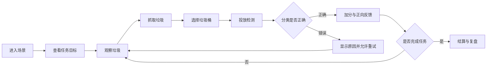

# ParkClean VR 垃圾分类小游戏 PRD

## 1. 文档信息

| 项目 | 内容 |
| --- | --- |
| 产品名称 | ParkClean VR 垃圾分类小游戏 |
| 当前阶段 | 从清扫社区 Demo 重构为垃圾分类 VR 教育 Demo |
| 目标版本 | MVP |
| 目标平台 | Unity VR，优先支持桌面调试，后续适配 VR 头显 |
| 核心主题 | VR 与可持续发展、垃圾分类教育、环境行为转化 |

## 2. 背景与问题

当前工程已有一个以社区清扫为基础的 Unity Demo，包含场景资源、垃圾素材、倒计时、清理计数和胜负面板。这个 Demo 能表达“清理垃圾”的基础动作，但还没有形成垃圾分类教育所需的判断、反馈和复盘机制。

垃圾分类教育的难点不在于用户完全不知道四类垃圾，而在于面对具体生活物品时容易犹豫。例如奶茶杯、油污外卖盒、污染纸巾、电池、过期药品等物品，单靠海报和文字说明很难形成稳定行为习惯。

ParkClean VR 的重构目标，是利用 VR 的沉浸感和具身交互，把垃圾分类从“看规则、背规则”变为“亲手做、即时学、可复盘”的体验。

## 3. 产品定位

ParkClean VR 是一款面向校园、社区和环保科普活动的 VR 垃圾分类教育小游戏。

产品不以复杂游戏系统为第一优先级，而以“教育闭环可成立、交互可演示、后续可扩展”为核心目标。用户应能在短时间内理解任务，通过动作完成分类，并在结果反馈中记住常见垃圾的分类依据。

## 4. 目标用户

| 用户类型 | 使用需求 | 设计重点 |
| --- | --- | --- |
| 中小学生 | 在趣味体验中认识四类垃圾 | 强引导、明确反馈、低难度起步 |
| 大学生 | 在校园生活场景中形成分类习惯 | 真实物品、任务挑战、错误复盘 |
| 社区居民 | 学会处理日常易混淆垃圾 | 生活化场景、实用解释 |
| 环保活动参与者 | 快速获得沉浸式科普体验 | 快速上手、流程完整、适合展示 |
| 初次 VR 用户 | 顺利完成体验且不眩晕 | 固定场景、清晰 UI、坐姿支持 |

## 5. 产品目标

### 5.1 用户目标

- 用户能理解可回收物、有害垃圾、厨余垃圾、其他垃圾四类规则。
- 用户能对常见生活垃圾进行判断和投放。
- 用户能从错误反馈中知道为什么分错。
- 用户体验后能把部分规则迁移到现实生活。

### 5.2 业务与展示目标

- 形成一个可演示、可讲解、可答辩的 VR 环保教育 Demo。
- 体现设计师、开发工程师、动画师、数据分析员、影响分析员的跨学科协作。
- 为后续增加多场景、多垃圾类型、数据分析和环保影响评估留下结构空间。

### 5.3 技术目标

- 从硬编码清扫计数升级为数据驱动的分类判定。
- 保持 VR 场景稳定运行，优先保证帧率和低延迟。
- 用模块化脚本承载交互、规则、反馈、任务和数据记录。
- 允许先在桌面环境调试，再接入 XR Interaction Toolkit 或 OpenXR 交互。

## 6. MVP 范围

### 6.1 必须实现

| 模块 | MVP 要求 |
| --- | --- |
| 场景 | 1 个校园食堂或社区垃圾投放点场景 |
| 垃圾桶 | 四分类垃圾桶：可回收物、有害垃圾、厨余垃圾、其他垃圾 |
| 垃圾物品 | 12 个以内，每类约 3 个 |
| 交互 | 选中、抓取、移动、投放 |
| 判定 | 比对垃圾类别与垃圾桶类别 |
| 反馈 | 正确、错误、原因说明、允许重试 |
| 任务 | 倒计时、目标数量、完成/失败判断 |
| UI | 任务提示、倒计时、进度、结算面板 |
| 数据 | 用时、正确数、错误数、正确率、错误物品列表 |

### 6.2 暂不实现

| 内容 | 暂缓原因 |
| --- | --- |
| 多场景自由切换 | MVP 先验证核心闭环 |
| 复杂手势识别 | 设备适配和实现成本较高 |
| 联网排行榜 | 与教育闭环关系较弱 |
| 完整成就系统 | 后续可扩展 |
| 复杂环境影响模拟 | MVP 先用结算文案表达 |
| 长期用户画像 | 需要更完整的数据基础 |

## 7. 核心体验流程

## 8. 功能需求

### 8.1 垃圾物品系统

每个垃圾物品需要具备：

- 名称，例如“塑料瓶”“旧电池”“污染纸巾”。
- 分类，例如可回收物、有害垃圾、厨余垃圾、其他垃圾。
- 难度，例如基础、易混淆、挑战。
- 解释文案，用于错误反馈和结算复盘。
- 模型或 Prefab 引用。
- 初始位置，用于错误重试时复位。

建议后续使用 ScriptableObject 或 JSON 配置，减少硬编码。

### 8.2 垃圾桶系统

每个垃圾桶需要具备：

- 垃圾桶类型。
- 颜色、文字和图标标识。
- 桶口触发区域。
- 正确投放反馈表现。
- 错误投放反馈表现。

四类垃圾桶应同时使用颜色、图标和文字，不只依赖颜色，以照顾色弱用户。

### 8.3 分类规则系统

系统在垃圾进入桶口触发区时：

1. 获取垃圾物品的分类属性。
2. 获取目标垃圾桶的类型。
3. 比对是否一致。
4. 返回判定结果。
5. 将结果交给反馈、任务和数据模块。

MVP 分类口径：

| 分类 | 典型物品 |
| --- | --- |
| 可回收物 | 干净塑料瓶、纸箱、易拉罐 |
| 有害垃圾 | 旧电池、过期药品、灯管 |
| 厨余垃圾 | 剩饭、果皮、菜叶 |
| 其他垃圾 | 污染纸巾、奶茶杯、油污外卖盒 |

### 8.4 交互系统

MVP 可先支持桌面点击或射线模拟，后续接入 VR 手柄射线抓取。

交互要求：

- 可选中垃圾，选中时有高亮。
- 可抓取并移动垃圾。
- 投放到桶口区域后触发判断。
- 投错后垃圾复位或回到玩家手边。
- 投对后垃圾进入桶内、隐藏或销毁。

### 8.5 反馈系统

正确反馈：

- 显示“分类正确”。
- 垃圾桶绿色高亮或播放轻量动画。
- 播放积极音效。
- 更新进度和得分。

错误反馈：

- 显示“分类错误”。
- 展示正确类别和原因。
- 播放温和提示音或轻微震动。
- 不计入完成数，允许重试。

示例文案：

- “旧电池属于有害垃圾，不能投入其他垃圾桶。”
- “污染纸巾已经不可回收，应投入其他垃圾。”
- “剩饭属于厨余垃圾，可以用于有机处理。”

### 8.6 任务与结算系统

MVP 推荐任务：

- 目标数量：12 件垃圾。
- 倒计时：180 秒。
- 胜利条件：时间内正确完成全部垃圾。
- 失败条件：倒计时结束仍未完成。

结算页展示：

- 完成状态。
- 总用时。
- 正确数量。
- 错误次数。
- 正确率。
- 易错物品列表。
- 简短环保影响反馈。

### 8.7 数据记录系统

MVP 本地记录即可，字段建议：

| 字段 | 说明 |
| --- | --- |
| sessionId | 单轮体验 ID |
| itemId | 垃圾物品 ID |
| itemName | 垃圾名称 |
| correctCategory | 正确分类 |
| selectedBin | 用户投放垃圾桶 |
| isCorrect | 是否正确 |
| attemptIndex | 第几次尝试 |
| timestamp | 投放时间 |
| elapsedTime | 从任务开始到投放的耗时 |

后续可扩展为 CSV 导出或上传服务器，用于分析正确率、错误类型、学习留存和环保行为转化。

## 9. 非功能需求

### 9.1 VR 舒适性

- 优先固定场景或小范围移动。
- 避免强制快速转身、奔跑和频繁低头。
- UI 保持在舒适视野范围内。
- 支持坐姿体验。
- 降低投放精度要求，桶口判定区域适度宽容。

### 9.2 性能

- VR 目标帧率不低于 72 FPS。
- 控制模型面数和材质复杂度。
- 减少非必要实时光照和复杂物理。
- 对可重复生成的垃圾物品考虑对象池。
- 动画使用轻量关键帧和 LOD 策略。

### 9.3 可扩展性

- 新增垃圾应优先通过配置完成。
- 新增场景应复用交互、规则、反馈和数据模块。
- 分类规则应避免写死在具体场景脚本中。
- UI 文案、反馈文案、物品数据应便于维护。

## 10. 动画与声音需求

动画师重点：

- 虚拟手抓取动作区分捏取小物件和满握大物件。
- 垃圾运动要体现材质和重量差异，例如纸团、塑料瓶、电池的惯性不同。
- 垃圾桶可在靠近或投放时播放桶盖开合、轻微光效或入桶动画。
- 错误提示弹出要轻量，避免遮挡视线。
- 动画触发点要与投放判定同步，避免“看起来投进了但系统没判定”的割裂感。

声音需求：

- 抓取音效轻微自然。
- 正确音效短促积极。
- 错误音效温和提醒。
- 结算音效用于明确任务完成。

## 11. 验收标准

MVP 可按以下标准验收：

- 用户能在 3 分钟内完成一轮完整垃圾分类任务。
- 四类垃圾桶均可正确判定。
- 至少 12 个垃圾物品具备分类属性和解释文案。
- 正确、错误、重试、完成、失败流程均可触发。
- 结算页能展示基础统计和错误复盘。
- 新增一个垃圾物品不需要改动核心判定代码。
- 桌面调试场景稳定运行，VR 接入后无明显卡顿或强眩晕交互。

## 12. 版本路线图

| 版本 | 目标 |
| --- | --- |
| V0.1 清扫基础 | 保留当前清扫、计数、倒计时、胜负面板 |
| V0.2 分类核心 | 加入垃圾分类属性、垃圾桶判定、正确/错误反馈 |
| V0.3 MVP 演示 | 完成 1 个场景、12 个垃圾、结算复盘 |
| V0.4 VR 适配 | 接入 XR 抓取或射线交互，优化舒适性 |
| V0.5 数据评估 | 增加行为日志、统计图表、环保影响文案 |
| V1.0 扩展版 | 多场景、多难度、复盘关和更完整评估体系 |

## 13. 风险与对策

| 风险 | 影响 | 对策 |
| --- | --- | --- |
| 只停留在清扫玩法 | 教育价值不足 | 必须引入分类判断和错误解释 |
| VR 眩晕 | 用户无法完成体验 | 固定场景、射线抓取、减少移动 |
| 垃圾模型不清晰 | 用户无法判断分类 | 强化材质、污渍、标签和比例 |
| 分类规则争议 | 影响可信度 | MVP 使用简化口径，并在文案中说明 |
| 脚本硬编码 | 后续难扩展 | 数据驱动物品和规则 |
| 帧率不稳定 | 体验下降 | 模型压缩、简化物理、控制动画复杂度 |

