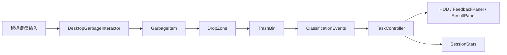

# ParkClean VR 项目结构设计

## 1. 文档定位

本文档描述 ParkClean VR 在 V0.3 阶段的工程结构设计。重点是让三名开发可以分模块开发、减少冲突，并让当前已导入的 MVP 模型资源能被清晰接入。

V0.3 阶段不追求一次性整理成最终工程结构。原则是：

- 现有可用资源不大规模搬迁。
- 新增 V0.3 代码放入清晰目录。
- 新增模型资源放入 `Assets/Art/`。
- 后续 Prefab、数据和脚本逐步规范化。

## 2. 当前真实结构

当前项目是 Unity 工程，已有基础目录：

```text
vr-waste-sorting/
├── Assets/
│   ├── Art/
│   │   ├── GarbageItems/
│   │   └── TrashBins/
│   ├── CubexCube - Free City Pack I/
│   ├── Low poly Garbage Pack/
│   ├── POLYGON city pack/
│   ├── Scenes/
│   ├── Scripts/
│   ├── Sounds/
│   └── Textrues/
├── Packages/
├── ProjectSettings/
├── README.md
└── docs/
    ├── PRD.md
    ├── PROJECT_STRUCTURE.md
    ├── design/
    └── plan/
```

说明：

- `Assets/Art/` 是 V0.3 新增模型资源目录。
- 原 `3D-Model/` 中的 MVP 模型已按规范移动到 `Assets/Art/`。
- 旧脚本仍在 `Assets/Scripts/` 根目录，可作为参考，但不建议继续堆新逻辑。

## 3. 当前资产落位

### 3.1 垃圾模型

目录：

```text
Assets/Art/GarbageItems/
```

文件：

```text
garbage_aluminum_can.glb
garbage_battery.glb
garbage_cardboard_box.glb
garbage_dirty_tissue.glb
garbage_expired_medicine.glb
garbage_fruit_peel.glb
garbage_lamp_tube.glb
garbage_leftover_rice.glb
garbage_milk_tea_cup.glb
garbage_oily_takeout_box.glb
garbage_plastic_bottle.glb
garbage_vegetable_leaf.glb
```

### 3.2 垃圾桶模型

目录：

```text
Assets/Art/TrashBins/
```

文件：

```text
bin_hazardous_red.glb
bin_kitchen_green.glb
bin_other_gray.glb
bin_recyclable_blue.glb
References/trash_bin_reference.webp
```

## 4. V0.3 目标结构

V0.3 推荐逐步形成以下结构：

```text
Assets/
├── Art/
│   ├── GarbageItems/
│   ├── TrashBins/
│   ├── Environment/
│   ├── UI/
│   └── FX/
├── Prefabs/
│   ├── GarbageItems/
│   ├── TrashBins/
│   ├── Environment/
│   └── UI/
├── Scenes/
├── Scripts/
│   ├── Gameplay/
│   ├── Player/
│   ├── Interaction/
│   ├── Core/
│   ├── UI/
│   └── Analytics/
└── Sounds/
```

本阶段可先创建用到的目录，不强制一次性补齐所有目录。

## 5. 脚本分区

### 5.1 Gameplay

路径：

```text
Assets/Scripts/Gameplay/
```

负责人：开发 A。

职责：

- 垃圾分类枚举。
- 垃圾物品组件。
- 垃圾桶组件。
- 投放触发区。
- 分类结果结构。
- 分类事件出口。

建议文件：

```text
WasteCategory.cs
GarbageItem.cs
TrashBin.cs
DropZone.cs
ClassificationResult.cs
ClassificationEvents.cs
```

边界：

- 不处理键鼠输入。
- 不处理 UI 结算。
- 不直接修改任务分数。

### 5.2 Player

路径：

```text
Assets/Scripts/Player/
```

负责人：开发 B。

职责：

- WASD 移动。
- 鼠标视角。
- 玩家摄像机控制。

建议文件：

```text
PlayerController.cs
```

边界：

- 不放倒计时。
- 不放分类判定。
- 不放结算 UI。

### 5.3 Interaction

路径：

```text
Assets/Scripts/Interaction/
```

负责人：开发 B。

职责：

- 鼠标射线选中。
- 垃圾高亮。
- 抓取和释放。
- 和 `GarbageItem` 状态对接。

建议文件：

```text
DesktopGarbageInteractor.cs
SelectableHighlighter.cs
CrosshairController.cs
```

边界：

- 不判断分类正误。
- 不记录正确率。
- 不控制结算页。

### 5.4 Core

路径：

```text
Assets/Scripts/Core/
```

负责人：开发 C。

职责：

- 游戏状态。
- 任务开始和结束。
- 倒计时。
- 成功/失败判断。
- 重开流程。

建议文件：

```text
GameManager.cs
TaskController.cs
```

### 5.5 UI

路径：

```text
Assets/Scripts/UI/
```

负责人：开发 C。

职责：

- HUD。
- 正确/错误提示。
- 结算面板。
- 物品名提示。

建议文件：

```text
HUDController.cs
FeedbackPanel.cs
ResultPanel.cs
```

### 5.6 Analytics

路径：

```text
Assets/Scripts/Analytics/
```

负责人：开发 C。

职责：

- 当轮统计。
- 错误记录。
- 正确率计算。

建议文件：

```text
SessionStats.cs
WrongAttemptRecord.cs
```

V0.3 不做服务器上传和长期存储。

## 6. 旧脚本处理

当前旧脚本：

```text
Assets/Scripts/Player.cs
Assets/Scripts/Garbage.cs
Assets/Scripts/SceneController.cs
```

处理建议：

| 旧脚本 | 当前问题 | V0.3 处理方式 |
| --- | --- | --- |
| `Player.cs` | 同时负责移动、视角、跳跃、倒计时、计数、胜负面板 | 不继续追加新逻辑，拆分到 `Player/` 和 `Core/` |
| `Garbage.cs` | 点击即计数并销毁，不能表达分类 | 不继续使用为核心逻辑，替换为 `GarbageItem.cs` |
| `SceneController.cs` | 场景切换和退出 | 可保留，后续归入 Core 或 UI 按钮流程 |

原则：

- 不要直接删除旧脚本，避免场景引用丢失。
- 新功能先写新脚本。
- 联调稳定后再逐步清理旧引用。

## 7. Prefab 结构

### 7.1 GarbageItem Prefab

目录：

```text
Assets/Prefabs/GarbageItems/
```

命名：

```text
PF_Garbage_PlasticBottle
PF_Garbage_CardboardBox
PF_Garbage_MilkTeaCup
```

推荐组件：

```text
Model
Collider
Rigidbody
GarbageItem
SelectableHighlighter
```

配置字段：

- `itemId`
- `itemName`
- `category`
- `wrongReason`

### 7.2 TrashBin Prefab

目录：

```text
Assets/Prefabs/TrashBins/
```

命名：

```text
PF_Bin_RecyclableBlue
PF_Bin_HazardousRed
PF_Bin_KitchenGreen
PF_Bin_OtherGray
```

推荐结构：

```text
PF_Bin_RecyclableBlue
├── Model
└── DropZone
```

推荐组件：

```text
TrashBin
DropZone
Trigger Collider
```

`DropZone` 应作为垃圾桶子物体，放在桶口或桶前方，判定范围可适当放大。

## 8. 场景结构

V0.3 场景建议使用：

```text
Assets/Scenes/MVP.unity
```

或沿用现有场景，但内部结构建议整理为：

```text
SceneRoot
├── Managers
│   ├── GameManager
│   └── TaskController
├── Player
│   ├── PlayerController
│   └── Camera
├── Environment
├── Gameplay
│   ├── GarbageItems
│   └── TrashBins
├── UI
│   ├── HUD
│   ├── FeedbackPanel
│   └── ResultPanel
└── Audio
```

V0.3 不需要 XR Rig。后续 VR 适配时再新增 `XR/` 或 `XROrigin`。

## 9. 数据流



说明：

- 开发 B 负责把垃圾送入 `DropZone`。
- 开发 A 负责生成分类结果。
- 开发 C 负责消费分类结果并更新 UI。

## 10. 公共接口约定

### 10.1 分类枚举

```csharp
public enum WasteCategory
{
    Recyclable,
    Hazardous,
    Kitchen,
    Other
}
```

### 10.2 垃圾状态

V0.3 至少需要：

```text
Idle
Held
Completed
```

### 10.3 分类结果

`ClassificationResult` 至少包含：

```text
GarbageItem item
TrashBin bin
bool isCorrect
WasteCategory correctCategory
WasteCategory selectedCategory
string reason
```

### 10.4 分类事件

建议：

```text
ClassificationEvents.OnClassified(ClassificationResult result)
```

开发 C 订阅该事件，开发 B 不直接参与统计。

## 11. 资源命名规范

### 11.1 模型文件

使用小写英文和下划线：

```text
garbage_plastic_bottle.glb
bin_recyclable_blue.glb
```

### 11.2 Prefab

使用 `PF_` 前缀和 PascalCase：

```text
PF_Garbage_PlasticBottle
PF_Bin_RecyclableBlue
```

### 11.3 数据 ID

使用和模型文件一致的无扩展名形式：

```text
garbage_plastic_bottle
bin_recyclable_blue
```

## 12. 开发协作结构

开发规范见：

```text
docs/plan/V0.3-开发协作规范.md
```

关键规则：

- 每人 checkout 自己分支。
- 开发完成提交 PR。
- 不直接合入主分支。
- 由统筹负责人审核后合入。
- 公共接口改动必须先沟通。

## 13. 后续扩展结构

V0.4 或之后可新增：

```text
Assets/Scripts/XR/
Assets/Scripts/Feedback/
Assets/Data/GarbageItems/
Assets/Data/Levels/
Assets/Prefabs/XR/
```

扩展方向：

- VR 输入适配。
- ScriptableObject 数据配置。
- 音效、震动、动画反馈。
- 多场景和多难度。
- 数据导出和分析。

