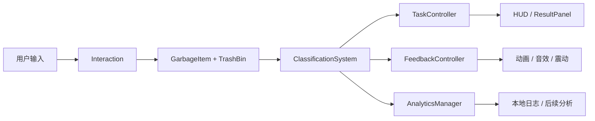

# ParkClean VR 项目结构设计大纲

## 1. 当前项目结构概览

```text
vr-waste-sorting/
├── 3D-Model/
│   ├── 可回收垃圾桶.glb
│   ├── 有害垃圾桶.glb
│   ├── 厨余垃圾桶.glb
│   ├── 其他垃圾桶.glb
│   └── 垃圾桶图片.webp
├── Assets/
│   ├── CubexCube - Free City Pack I/
│   ├── Low poly Garbage Pack/
│   ├── POLYGON city pack/
│   ├── Scenes/
│   ├── Scripts/
│   ├── Sounds/
│   └── Textrues/
├── Packages/
├── ProjectSettings/
└── docs/
    ├── PRD.md
    ├── PROJECT_STRUCTURE.md
    ├── design/
    └── 使用AI生成3D模型并导入Unity.md
```

当前工程具备 Unity 项目的基本结构，已有场景、脚本、声音、城市环境资源、低多边形垃圾资源和四分类垃圾桶模型。现有脚本偏向清扫 Demo，需要逐步重构为垃圾分类系统。

## 2. 当前脚本现状

| 文件 | 当前职责 | 重构方向 |
| --- | --- | --- |
| `Assets/Scripts/Player.cs` | 玩家移动、鼠标视角、跳跃、倒计时、清理计数、胜负面板 | 拆分为玩家控制、任务计时、UI 展示，不再让 Player 承担全部逻辑 |
| `Assets/Scripts/Garbage.cs` | 鼠标点击垃圾后计数、播放音效、销毁物体 | 重构为垃圾物品数据组件，记录分类、解释、初始位置和状态 |
| `Assets/Scripts/SceneController.cs` | 场景切换、退出游戏 | 保留为场景流程控制的一部分 |

## 3. 推荐目标目录结构

后续重构建议逐步演进到以下结构：

```text
Assets/
├── Art/
│   ├── Environment/
│   ├── GarbageItems/
│   ├── TrashBins/
│   └── UI/
├── Audio/
│   ├── SFX/
│   └── Music/
├── Data/
│   ├── GarbageItems/
│   ├── Levels/
│   └── Rules/
├── Materials/
├── Prefabs/
│   ├── Environment/
│   ├── GarbageItems/
│   ├── TrashBins/
│   ├── Player/
│   └── UI/
├── Scenes/
│   ├── MainMenu.unity
│   ├── Canteen_MVP.unity
│   └── Community_MVP.unity
├── Scripts/
│   ├── Core/
│   ├── Data/
│   ├── Gameplay/
│   ├── Interaction/
│   ├── Feedback/
│   ├── UI/
│   ├── Analytics/
│   └── Utils/
└── XR/
    ├── Input/
    └── Rig/
```

如果当前资源量较少，不需要一次性移动全部文件。优先完成脚本和 Prefab 的职责拆分，资源目录可以随着开发逐步整理。

## 4. 核心脚本模块设计

### 4.1 Core

职责：管理游戏主流程和全局状态。

建议脚本：

| 脚本 | 职责 |
| --- | --- |
| `GameManager.cs` | 控制开始、进行中、暂停、结算等状态 |
| `LevelManager.cs` | 加载关卡配置、生成垃圾、初始化垃圾桶 |
| `SceneFlowController.cs` | 场景切换、重新开始、退出 |

### 4.2 Data

职责：定义可配置数据结构，避免把分类规则写死在 MonoBehaviour 中。

建议脚本或资源：

| 名称 | 职责 |
| --- | --- |
| `WasteCategory.cs` | 定义四类垃圾枚举 |
| `GarbageItemData.cs` | 定义垃圾名称、分类、难度、解释、Prefab |
| `LevelData.cs` | 定义关卡场景、倒计时、垃圾清单、目标数量 |
| `FeedbackTextData.cs` | 管理正确和错误提示文案 |

推荐枚举：

```csharp
public enum WasteCategory
{
    Recyclable,
    Hazardous,
    Kitchen,
    Other
}
```

### 4.3 Gameplay

职责：承载垃圾分类的核心规则和任务目标。

建议脚本：

| 脚本 | 职责 |
| --- | --- |
| `GarbageItem.cs` | 挂在垃圾物体上，记录当前垃圾数据和状态 |
| `TrashBin.cs` | 挂在垃圾桶上，记录桶类型和触发区 |
| `ClassificationSystem.cs` | 比对垃圾类别和垃圾桶类别，返回判定结果 |
| `TaskController.cs` | 管理倒计时、完成数量、胜负条件 |
| `ScoreController.cs` | 管理得分、正确数、错误数、连击等 |

### 4.4 Interaction

职责：处理桌面调试、VR 射线、抓取、释放和投放输入。

建议脚本：

| 脚本 | 职责 |
| --- | --- |
| `GarbageSelectable.cs` | 处理选中、高亮 |
| `GarbageGrabber.cs` | 处理抓取、跟随、释放 |
| `DesktopInteractionAdapter.cs` | 桌面鼠标调试输入 |
| `XRInteractionAdapter.cs` | VR 手柄或射线输入适配 |
| `DropZone.cs` | 桶口投放区域触发 |

设计原则：

- 分类规则不直接写在交互脚本中。
- 桌面输入和 XR 输入只负责“用户做了什么”。
- 分类系统负责“这个行为结果是否正确”。

### 4.5 Feedback

职责：统一处理视觉、声音、震动和动画反馈。

建议脚本：

| 脚本 | 职责 |
| --- | --- |
| `FeedbackController.cs` | 对外提供正确、错误、完成等反馈入口 |
| `TrashBinFeedback.cs` | 垃圾桶高亮、桶盖动画、入桶反馈 |
| `GarbageFeedback.cs` | 垃圾高亮、复位、消失或落入桶内 |
| `HapticFeedback.cs` | 手柄震动 |
| `AudioFeedback.cs` | 正确、错误、抓取、完成音效 |

### 4.6 UI

职责：展示任务信息、倒计时、进度、提示和结算。

建议脚本：

| 脚本 | 职责 |
| --- | --- |
| `HUDController.cs` | 倒计时、进度、当前提示 |
| `PromptPanel.cs` | 正确/错误原因提示 |
| `ResultPanel.cs` | 结算页 |
| `TutorialPanel.cs` | 新手引导 |

UI 要求：

- 字号足够大，适合 VR 阅读。
- 提示短句优先，不堆长段文字。
- UI 固定在舒适视野范围内。

### 4.7 Analytics

职责：记录行为数据，支持数据分析员和影响分析员后续评估。

建议脚本：

| 脚本 | 职责 |
| --- | --- |
| `AnalyticsManager.cs` | 统一记录用户操作事件 |
| `SessionRecord.cs` | 保存单轮体验统计 |
| `ClassificationAttemptRecord.cs` | 保存单次投放尝试 |
| `LocalCsvExporter.cs` | 可选，将日志导出为 CSV |

推荐事件：

- `SessionStarted`
- `ItemGrabbed`
- `ItemDropped`
- `ClassificationCorrect`
- `ClassificationWrong`
- `ItemRetried`
- `SessionCompleted`

## 5. 数据流设计



关键原则：

- 输入层只描述动作。
- 规则层只负责判断。
- 反馈层只负责表现。
- 数据层只负责记录。
- UI 层只负责展示。

## 6. 场景结构建议

MVP 场景 `Canteen_MVP.unity` 或 `Community_MVP.unity` 建议包含：

```text
SceneRoot
├── Managers
│   ├── GameManager
│   ├── LevelManager
│   ├── TaskController
│   ├── FeedbackController
│   └── AnalyticsManager
├── XR
│   ├── XROrigin
│   └── InteractionRay
├── Environment
│   ├── Floor
│   ├── Tables
│   ├── Buildings
│   └── Props
├── Gameplay
│   ├── GarbageSpawnPoints
│   ├── GarbageItems
│   └── TrashBins
├── UI
│   ├── WorldSpaceHUD
│   ├── PromptPanel
│   └── ResultPanel
└── Audio
    ├── BGM
    └── SFX
```

## 7. Prefab 设计

### 7.1 GarbageItem Prefab

组成建议：

- 模型 Mesh。
- Collider。
- Rigidbody。
- `GarbageItem`。
- `GarbageSelectable`。
- 高亮组件或描边材质。

关键配置：

- `itemData`：垃圾数据引用。
- `resetPosition`：错误复位点。
- `isClassified`：是否已正确分类。

### 7.2 TrashBin Prefab

组成建议：

- 桶身模型。
- 桶口 Trigger Collider。
- 颜色、文字、图标标识。
- `TrashBin`。
- `TrashBinFeedback`。

关键配置：

- `category`：垃圾桶类别。
- `dropZone`：投放触发区域。
- `correctEffect`、`wrongEffect`：反馈表现。

## 8. 重构步骤建议

### 第一阶段：保留可运行 Demo，拆出分类概念

目标：

- 增加 `WasteCategory`。
- 将 `Garbage.cs` 改为记录垃圾类别。
- 增加 `TrashBin.cs` 和桶口触发判断。
- 暂时保留现有倒计时和胜负 UI。

### 第二阶段：替换清扫计数为分类任务

目标：

- 正确投放才增加完成数。
- 错误投放不销毁垃圾，显示原因并允许重试。
- 结算页显示正确率和错误次数。

### 第三阶段：整理数据与反馈

目标：

- 引入 `GarbageItemData`。
- 将错误解释从代码移动到数据配置。
- 增加 `FeedbackController`。
- 增加本地行为日志。

### 第四阶段：接入 VR 交互

目标：

- 桌面点击调试和 XR 射线抓取并存。
- 优化桶口判定范围。
- 加入手柄震动、空间 UI 和低眩晕体验设置。

### 第五阶段：资源和性能整理

目标：

- 整理垃圾、垃圾桶和场景资源目录。
- 降低模型复杂度。
- 优化材质和光照。
- 检查 VR 帧率和输入延迟。

## 9. 命名规范建议

### 9.1 文件命名

- C# 脚本：`PascalCase.cs`，例如 `GarbageItem.cs`。
- Prefab：`PF_类型_名称`，例如 `PF_Garbage_PlasticBottle`。
- 材质：`MAT_名称`。
- 音效：`SFX_动作_结果`，例如 `SFX_Drop_Correct`。
- 场景：`场景名_版本`，例如 `Canteen_MVP`。

### 9.2 分类命名

| 中文 | 英文建议 |
| --- | --- |
| 可回收物 | `Recyclable` |
| 有害垃圾 | `Hazardous` |
| 厨余垃圾 | `Kitchen` |
| 其他垃圾 | `Other` |

## 10. 团队协作边界

| 角色 | 主要交付 |
| --- | --- |
| 设计师 | 体验流程、场景布局、UI 信息、错误反馈文案 |
| 开发工程师 | 交互系统、分类规则、任务流程、数据记录 |
| 动画师 | 抓取、投放、桶盖、反馈 UI 和低眩晕动画 |
| 数据分析员 | 指标体系、日志字段、正确率和留存分析 |
| 影响分析员 | 环保影响解释、社会价值、风险与可持续性评估 |

## 11. 与现有文档关系

- `docs/PRD.md`：定义产品目标、功能范围和验收标准。
- `docs/PROJECT_STRUCTURE.md`：定义工程结构和重构方向。
- `docs/design/VR垃圾分类小游戏总体设计文档.md`：提供完整体验设计背景。
- `docs/design/MVP设计方案.md`：提供首个版本的具体玩法取舍。
- `docs/design/modules/`：按模块拆分细节，可作为实现任务来源。
