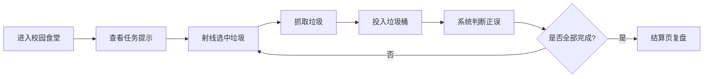

# ParkClean VR MVP 设计方案

## 1. MVP 定位

MVP 的目标不是一次性实现完整的 VR 垃圾分类教育系统，而是先做出一个“能玩、能演示、能说明核心价值”的最小可用版本。

本版本聚焦一条完整体验闭环：

> 用户进入校园食堂场景，通过射线抓取垃圾，将垃圾投入四分类垃圾桶，系统判断正误并给出提示，最后展示用时、正确率和错误复盘。

只要这个闭环成立，项目就已经能证明 VR 垃圾分类小游戏的核心概念：用户不是在做选择题，而是在虚拟场景中亲手完成分类行为。

## 2. 已确认取舍

| 设计点 | MVP 决策 | 原因 |
| --- | --- | --- |
| 首个场景 | 校园食堂 | 贴近学生项目语境，垃圾类型丰富，答辩容易解释 |
| 交互方式 | 射线抓取 | 实现更稳定，减少弯腰和眩晕风险 |
| 环保影响 | 结算页文案表达 | 暂不做复杂场景状态切换 |
| 连击与成就 | 暂缓 | 非核心闭环，避免增加 UI 和状态管理复杂度 |

## 3. MVP 核心体验流程

## 4. MVP 功能范围

### 4.1 必须实现

| 模块 | MVP 内容 |
| --- | --- |
| 场景 | 1 个校园食堂场景 |
| 垃圾桶 | 四分类垃圾桶：可回收物、有害垃圾、厨余垃圾、其他垃圾 |
| 垃圾物品 | 12 个以内，每类 3 个 |
| 交互 | 射线选中、抓取、移动、投放 |
| 判断 | 垃圾类别与垃圾桶类别匹配判断 |
| 反馈 | 正确提示、错误提示、错误原因、允许重试 |
| 游戏流程 | 倒计时、分类目标数量、完成/失败判断 |
| UI | 任务提示、倒计时、进度、结算页 |
| 数据 | 正确数量、错误数量、正确率、用时、错误物品 |

### 4.2 暂不实现

| 内容 | 暂缓原因 |
| --- | --- |
| 多场景切换 | 增加建模、布置和测试成本 |
| 手势识别 | 技术和设备适配成本高 |
| 近距离抓取 | 与射线抓取同时做会增加交互复杂度 |
| 连击系统 | 非核心玩法 |
| 成就系统 | 需要额外 UI 和状态保存 |
| 复盘关 | 可先用结算页复盘替代 |
| 场景变整洁动画 | 资产状态切换成本较高 |
| 语音提示 | 需要音频制作和管理 |
| A/B Testing | 属于研究评估，不属于 Demo 核心功能 |

## 5. 场景设计

### 5.1 场景选择

MVP 使用“校园食堂”作为唯一场景。

场景包含：

- 1 个玩家起始点。
- 1-2 张餐桌。
- 食堂背景元素，如窗口、菜单牌、地砖、墙面。
- 1 个待分类垃圾摆放区。
- 1 组四分类垃圾桶。

### 5.2 场景布局

推荐布局：

- 玩家站在餐桌前方。
- 餐桌上摆放待分类垃圾。
- 四分类垃圾桶摆在玩家正前方或右前方。
- 垃圾和垃圾桶都在玩家不需要大幅移动的范围内。

MVP 不依赖传送和大范围移动，优先保证站立原地就能完成任务。

## 6. 垃圾物品清单

MVP 首批使用 12 个垃圾物品，每类 3 个。

| 分类 | 物品 | 设计说明 |
| --- | --- | --- |
| 可回收物 | 塑料瓶 | 透明瓶身、瓶盖、干净容器 |
| 可回收物 | 纸箱 | 小型快递纸箱、纸板纹理 |
| 可回收物 | 易拉罐 | 金属材质、拉环、可轻微压扁 |
| 厨余垃圾 | 剩饭 | 碗或餐盘中的米饭残留 |
| 厨余垃圾 | 果皮 | 香蕉皮或苹果皮，小堆形式 |
| 厨余垃圾 | 菜叶 | 几片绿色菜叶，带叶脉 |
| 有害垃圾 | 旧电池 | 正负极明显，可适当放大 |
| 有害垃圾 | 过期药品 | 药盒和药瓶组合，带医疗符号 |
| 有害垃圾 | 灯管 | 短款废旧灯管或节能灯 |
| 其他垃圾 | 污染纸巾 | 皱起纸团，带油渍或水渍 |
| 其他垃圾 | 奶茶杯 | 杯盖、吸管、残留液体 |
| 其他垃圾 | 油污外卖盒 | 半开餐盒，内部有油污 |

### 6.1 分类口径

为了降低 MVP 实现和教学复杂度，本版本采用简化分类口径：

- 干净塑料瓶、纸箱、易拉罐归为可回收物。
- 剩饭、果皮、菜叶归为厨余垃圾。
- 旧电池、过期药品、灯管归为有害垃圾。
- 污染纸巾、带残留液体的奶茶杯、油污外卖盒归为其他垃圾。

奶茶杯和外卖盒属于易混淆物品，模型中必须表现“残留液体”或“油污”，否则用户可能误以为它们属于可回收物。

## 7. 垃圾桶设计

MVP 需要一组四分类垃圾桶。

| 垃圾桶 | 颜色 | 图标 | 文字 |
| --- | --- | --- | --- |
| 可回收物 | 蓝色 | 循环箭头 | 可回收物 |
| 有害垃圾 | 红色 | 警示符号 | 有害垃圾 |
| 厨余垃圾 | 绿色 | 叶片/食物 | 厨余垃圾 |
| 其他垃圾 | 灰色/黑色 | 普通垃圾桶 | 其他垃圾 |

设计要求：

- 四个垃圾桶造型统一。
- 桶口清晰，方便添加触发检测区域。
- 文字和图标要大，用户在 VR 中能看清。
- 垃圾桶之间保持间距，降低误投。

## 8. 交互设计

### 8.1 交互方式

MVP 使用射线抓取。

用户操作流程：

1. 用手柄射线指向垃圾。
2. 被指向的垃圾出现高亮或选中提示。
3. 按下抓取键后垃圾跟随手柄移动。
4. 将垃圾移动到对应垃圾桶桶口。
5. 松开或进入桶口触发分类判断。

### 8.2 错误重试

如果投错：

1. 系统显示错误提示和正确类别。
2. 垃圾不计入完成数量。
3. 垃圾回到原位置或玩家手边。
4. 用户可以重新尝试。

MVP 不需要复杂动画，只要重试流程稳定即可。

## 9. 反馈设计

### 9.1 正确反馈

正确投放后：

- 显示“分类正确”。
- 垃圾桶出现绿色高亮或简单光效。
- 当前进度增加。
- 垃圾消失或落入桶中。

### 9.2 错误反馈

错误投放后：

- 显示“分类错误”。
- 显示正确类别和原因。
- 垃圾保留，允许重试。

示例：

- “污染纸巾不能回收，应投其他垃圾。”
- “旧电池属于有害垃圾。”
- “剩饭属于厨余垃圾。”

### 9.3 结算反馈

任务结束后显示：

- 是否完成任务。
- 总用时。
- 正确率。
- 错误物品列表。
- 简短环保影响文案。

环保影响文案示例：

> 本轮你减少了 9 次错误分类，模拟提升了资源回收效率。

## 10. 游戏机制

### 10.1 任务目标

推荐 MVP 任务：

- 分类目标：完成 12 件垃圾分类。
- 倒计时：180 秒。
- 胜利条件：时间内完成全部 12 件垃圾。
- 失败条件：倒计时结束仍未完成。

### 10.2 得分规则

MVP 使用简单得分：

- 正确投放：+10 分。
- 错误投放：不扣分，只记录错误。
- 重试成功：+10 分。

暂不实现连击、成就、排行榜。

## 11. UI 设计

### 11.1 游戏中 UI

需要显示：

- 当前任务：完成 12 件垃圾分类。
- 倒计时。
- 当前进度：例如 `4/12`。
- 当前分数。
- 临时正误提示。

### 11.2 结算 UI

需要显示：

- 任务完成/挑战失败。
- 得分。
- 正确率。
- 用时。
- 错误物品和正确分类。
- 重玩/返回按钮。

UI 原则：

- 字号大。
- 文字少。
- 面板不要遮挡垃圾和垃圾桶。
- 中文文案简短直接。

## 12. 数据记录

MVP 只记录当轮数据，不需要写入服务器。

需要记录：

- 总垃圾数。
- 正确投放次数。
- 错误投放次数。
- 每个错误物品名称。
- 错误投到的垃圾桶类型。
- 总用时。

这些数据用于结算页展示，不要求长期保存。

## 13. 混元建模优先级

### 13.1 第一优先级

- 校园食堂局部场景。
- 四分类垃圾桶一组。
- 12 个垃圾物品。

### 13.2 第二优先级

- UI 面板底板。
- 正确/错误提示光效。
- 射线选中光圈。

### 13.3 暂缓

- 成就徽章。
- 多场景环境。
- 数据图表看板。
- 复杂环保影响场景变化。
- 桶盖动画。

## 14. MVP 验收标准

### 14.1 核心功能验收

- 用户能进入校园食堂场景。
- 用户能看到四类垃圾桶和 12 个垃圾物品。
- 用户能通过射线抓取垃圾。
- 用户能把垃圾投入垃圾桶。
- 系统能判断分类正确或错误。
- 错误时能提示正确类别并允许重试。
- 完成后能显示结算页。

### 14.2 展示效果验收

- 老师或同学能在 1 分钟内理解游戏玩法。
- 垃圾模型能看出分类线索。
- 垃圾桶颜色、文字、图标清晰。
- 整个体验能体现“VR 让垃圾分类从记规则变成亲手做”。

## 15. 后续迭代方向

MVP 完成后，再考虑加入：

- 宿舍、社区投放点、公共空间等新场景。
- 更多易混淆垃圾。
- 连击和成就系统。
- 错误复盘关。
- 环保影响可视化。
- 本地 JSON/CSV 行为数据导出。
- A/B Testing 与学习效果评估。

## 16. 总结

MVP 的关键是完成“场景-垃圾-垃圾桶-抓取-投放-判断-反馈-结算”这一条最小闭环。只要这条闭环稳定，项目就已经具备可演示、可答辩、可继续扩展的基础。

完整方案中的多场景、成就、连击、复杂数据分析和环保影响动画都可以作为后续迭代，不进入首版开发范围。
