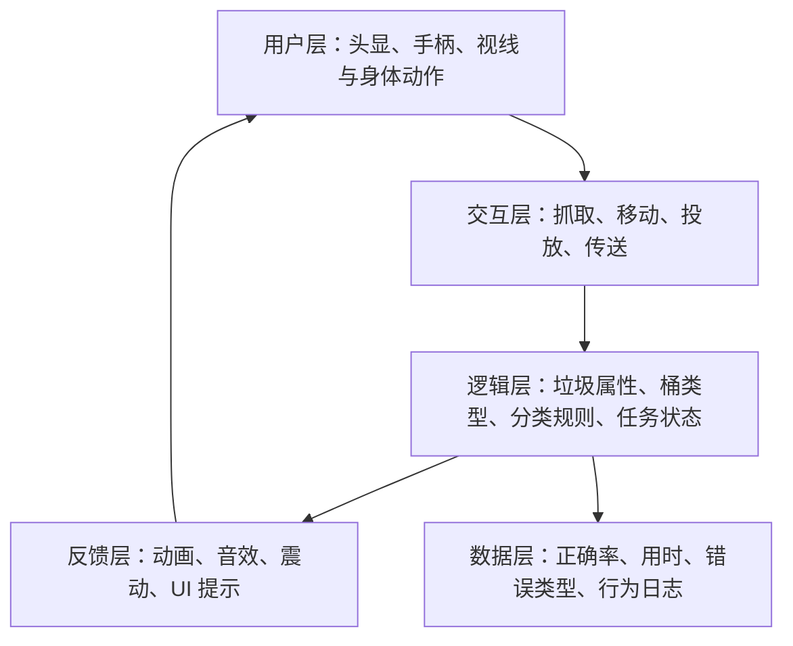

# VR 垃圾分类小游戏总体设计文档

## 1. 项目概述

### 1.1 项目名称

ParkClean VR：沉浸式垃圾分类教育小游戏

### 1.2 项目定位

本项目面向校园、社区和公共环保教育场景，设计一款基于 VR 的垃圾分类小游戏。用户在虚拟环境中通过观察、抓取、判断、投放和反馈复盘，完成接近真实生活的垃圾分类任务，从而把抽象的分类规则转化为可体验、可练习、可迁移的行为经验。

项目不是单纯展示垃圾分类知识，也不是只追求 VR 技术效果，而是通过沉浸式场景、自然交互、即时反馈和游戏化机制，帮助用户降低学习门槛、提升分类准确率，并增强现实生活中的环保行动意愿。

### 1.3 设计目标

- 让垃圾分类从“背规则”变成“亲手做”。
- 让环保教育从“被动听讲”变成“主动体验”。
- 让错误分类从“被惩罚”变成“即时学习”。
- 让用户在体验后能记住常见垃圾的分类方式，并愿意在现实生活中实践。
- 构建可扩展的 VR 环保教育 Demo，为后续增加场景、垃圾种类和数据分析功能留下空间。

### 1.4 当前项目基础

当前工程为 Unity 项目，已具备 VR 相关技术基础：

- 开发引擎：Unity。
- 渲染管线：URP。
- VR 框架：XR Interaction Toolkit。
- 输入支持：Input System、OpenXR、Oculus。
- 当前 Demo 能力：已有场景、垃圾素材包、城市/低多边形资源、倒计时、清扫目标计数、胜负面板和基础抓取交互。

后续设计应在现有 Demo 的“拾取/清扫”基础上，升级为“识别/分类/反馈/复盘”的完整垃圾分类体验。

## 2. 目标用户与使用场景

### 2.1 目标用户

| 用户类型 | 典型需求 | 设计重点 |
| --- | --- | --- |
| 中小学生 | 在趣味体验中理解基础分类规则 | 清晰提示、低难度起步、鼓励反馈 |
| 大学生 | 在校园生活场景中形成分类习惯 | 真实物品、任务挑战、错误复盘 |
| 社区居民 | 学会处理日常易混淆垃圾 | 生活化场景、实用解释、现实迁移 |
| 环保活动参与者 | 在短时间内获得沉浸式科普体验 | 快速上手、流程闭环、可展示成果 |
| 初次 VR 使用者 | 需要理解设备操作并避免眩晕 | 新手引导、固定场景、坐姿支持 |

### 2.2 核心使用场景

1. 校园食堂：剩饭、果皮、餐盒、纸巾、饮料瓶等高频垃圾。
2. 学生宿舍：纸箱、塑料袋、包装盒、旧衣物、电池等生活垃圾。
3. 社区投放点：玻璃瓶、废纸、过期药品、混合外卖垃圾等复杂垃圾。
4. 公共空间：饮料杯、易拉罐、包装纸等适合快速挑战的轻量场景。

### 2.3 场景选择原则

- 贴近日常生活，减少用户理解成本。
- 垃圾物品具有代表性和可辨识性。
- 场景范围不宜过大，避免 VR 快速移动带来的眩晕。
- 每个场景应能承载一组清晰的教学目标，例如“认识四类垃圾”“处理易混淆外卖垃圾”“识别有害垃圾”。

## 3. 核心体验流程

### 3.1 完整体验闭环

### 3.2 单轮任务流程

1. 用户进入虚拟校园/社区/宿舍场景。
2. 系统给出本轮目标，例如“在 3 分钟内完成 12 件垃圾分类”。
3. 用户观察垃圾外观、材质、污染程度和使用场景。
4. 用户通过 VR 手柄或手势抓取垃圾。
5. 用户判断垃圾类别，并将垃圾投入对应垃圾桶。
6. 系统判断结果并给出反馈。
7. 用户完成全部任务或倒计时结束。
8. 系统展示得分、正确率、用时、错误类型和环保影响。

### 3.3 体验关键词

- 沉浸感：场景、物品和动作贴近真实生活。
- 低门槛：减少复杂菜单，用动作和图标帮助理解。
- 即时反馈：每次投放都能立刻知道结果。
- 重复练习：通过关卡、连击和复盘鼓励多次尝试。
- 现实迁移：分类规则与现实垃圾桶颜色、标识和生活物品保持一致。

## 4. 游戏机制设计

### 4.1 基础玩法

用户需要在限定时间内，将散落在场景中的垃圾投入正确的分类垃圾桶。系统根据分类正确率、完成时间、连续正确次数和错误复盘结果计算得分。

### 4.2 垃圾分类类别

| 类别 | 视觉颜色 | 典型物品 | 设计说明 |
| --- | --- | --- | --- |
| 可回收物 | 蓝色 | 塑料瓶、废纸、纸箱、易拉罐、玻璃瓶 | 强调材质可回收、干净未污染 |
| 有害垃圾 | 红色 | 旧电池、过期药品、灯管、油漆桶 | 强调危险性和环境污染风险 |
| 厨余垃圾 | 绿色 | 剩饭、果皮、菜叶、茶叶渣 | 强调易腐、有机、来自厨房或餐饮 |
| 其他垃圾 | 灰色/黑色 | 污染纸巾、奶茶杯、外卖盒、烟头 | 强调无法归入前三类或被污染后不可回收 |

### 4.3 关卡结构

| 阶段 | 目标 | 垃圾复杂度 | 用户支持 |
| --- | --- | --- | --- |
| 教学关 | 学会抓取、投放、理解四类垃圾桶 | 简单物品，如塑料瓶、果皮、电池 | 强提示、箭头、高亮、语音 |
| 基础关 | 完成常见垃圾分类 | 日常高频物品 | 常规提示、错误解释 |
| 挑战关 | 处理易混淆垃圾 | 奶茶杯、油污餐盒、污染纸张、过期药品 | 减少提示、强调判断 |
| 复盘关 | 针对错误项重复练习 | 用户上一轮分错的物品 | 精准解释、再次尝试 |

### 4.4 得分规则

- 正确投放：增加基础分。
- 连续正确：获得连击奖励。
- 错误投放：不直接终止任务，显示原因并允许重新尝试。
- 超时：结束本轮，进入复盘界面。
- 高正确率：解锁成就称号，如“低碳达人”“校园环保志愿者”“社区环保官”。

### 4.5 游戏化边界

游戏机制服务于学习，不应让用户为了追求速度而忽略判断。计时和连击应制造轻度紧张感，但错误提示、复盘和重新尝试才是教育价值的核心。

## 5. 交互设计

### 5.1 核心交互动作

| 动作 | 用户行为 | 系统响应 |
| --- | --- | --- |
| 看 | 观察垃圾外观、材质、污染程度 | 可通过描边、高亮或标签提示可交互物体 |
| 拿 | 用手柄/手势抓取垃圾 | 物体跟随手部移动，播放抓取音效 |
| 判断 | 根据经验和提示选择垃圾桶 | 垃圾桶保持清晰颜色、图标和文字标识 |
| 投 | 将垃圾放入对应桶口区域 | 触发碰撞检测或区域检测 |
| 反馈 | 查看正确/错误结果 | 光效、音效、震动、文字原因和积分变化 |

### 5.2 操作原则

- 操作尽量模拟现实中的垃圾投放动作。
- 减少复杂菜单和多层 UI。
- 用空间、颜色、图标和动作承担主要信息传达。
- 保持投放判定区域适度宽容，降低精度挫败感。
- 对新手提供第一轮完整引导，避免用户进入场景后迷失。

### 5.3 VR 舒适性设计

- 优先采用固定场景、小范围移动或短距离传送。
- 避免强制用户快速转身、奔跑或频繁低头。
- 对抓取、抛掷和垃圾桶反馈使用平滑动画曲线。
- 支持坐姿体验，让更多用户能够参与。
- UI 信息应固定在舒适视野范围内，避免贴脸或漂移。

## 6. 视觉与信息设计

### 6.1 视觉风格

整体采用轻量、明亮、低多边形或半写实风格，保持亲和、清晰和性能友好。场景应表现出校园、社区和公共空间的生活感，不宜过度科幻化，以免削弱现实迁移效果。

### 6.2 垃圾桶设计

每个垃圾桶应同时具备颜色、文字和图标三层识别信息：

- 可回收物：蓝色 + 循环箭头图标 + “可回收物”。
- 有害垃圾：红色 + 警示图标 + “有害垃圾”。
- 厨余垃圾：绿色 + 食物/叶片图标 + “厨余垃圾”。
- 其他垃圾：灰色或黑色 + 普通垃圾图标 + “其他垃圾”。

这样可以避免只依赖颜色造成色弱用户识别困难。

### 6.3 垃圾物品设计

垃圾物品应尽量具体，而不是抽象图标。重点设计易混淆物：

- 奶茶杯：杯身、杯盖、吸管、残留液体可作为判断线索。
- 外卖盒：干净纸盒与油污餐盒应在材质和污渍上可区分。
- 纸巾：干净纸张与污染纸巾应有明显视觉差异。
- 电池/药品：应突出危险标识，强化有害垃圾记忆。

### 6.4 反馈视觉

- 正确：绿色光效、垃圾桶轻微发光、积分上升、积极音效。
- 错误：轻微震动、黄色/红色提示、显示正确类别和原因。
- 完成：展示评分面板、正确率、用时、环保影响和继续挑战入口。

错误反馈应简短、明确、可行动。例如：“污染纸巾不能回收，应投入其他垃圾。”

## 7. 动画与声音设计

### 7.1 动画目标

动画服务于真实感、舒适性和反馈可信度。用户需要相信自己真的完成了“拿起垃圾、移动、投放、入桶”的动作，而不是在触发一个抽象按钮。

### 7.2 关键动画

- 虚拟手抓取：区分捏取小物件和满握大物件。
- 垃圾运动：不同重量和材质具有不同惯性与抛掷轨迹。
- 垃圾桶反馈：靠近或投放时桶盖打开、桶身光效变化。
- 错误提示：UI 弹出应轻量，避免遮挡用户视线。
- 场景反馈：完成分类后，场景可从凌乱逐步变整洁。

### 7.3 声音反馈

- 抓取音：轻微、自然，不干扰判断。
- 正确音：短促积极，用于强化正确行为。
- 错误音：温和提醒，避免强烈挫败。
- 完成音：用于标识本轮任务结束。
- 语音提示：可用于新手引导和无障碍支持。

## 8. 系统架构设计

### 8.1 分层架构

### 8.2 核心模块

| 模块 | 职责 | 设计建议 |
| --- | --- | --- |
| GarbageItem | 记录垃圾名称、分类、解释、难度、模型引用 | 用数据配置驱动，便于新增垃圾 |
| TrashBin | 记录垃圾桶类型、投放区域、反馈表现 | 桶口使用触发器检测投放 |
| ClassificationRule | 判断垃圾类别与桶类型是否匹配 | 支持特殊规则和易混淆解释 |
| GameTaskManager | 控制倒计时、目标数量、胜负状态 | 替代单一清扫计数逻辑 |
| FeedbackManager | 管理光效、音效、震动、提示 UI | 统一反馈风格 |
| ScoreManager | 计算得分、连击、正确率 | 供结算页展示 |
| DataRecorder | 记录用时、错误物品、投放路径 | 为数据分析组提供依据 |
| TutorialManager | 管理新手引导和提示强度 | 教学关与正式关分离 |

### 8.3 当前 Demo 到目标系统的升级方向

现有代码中，`Garbage` 被抓取后会直接增加 `clearCount` 并销毁物体，适合“清扫目标”玩法。目标系统需要升级为：

1. 垃圾被抓取后不立即销毁，而是允许用户移动和投放。
2. 垃圾进入垃圾桶触发区域后，再判断分类是否正确。
3. 判断结果应来自垃圾物品属性和垃圾桶类型，而不是单纯计数。
4. 正确后销毁或放入桶内，错误后显示解释并允许重新尝试。
5. 结算面板展示正确率、错误清单和环保影响，而不仅是胜负。

## 9. 数据与评估设计

### 9.1 记录指标

| 指标 | 目的 |
| --- | --- |
| 分类正确率 | 衡量用户是否掌握规则 |
| 单个物品判断用时 | 识别用户犹豫或易混淆物品 |
| 错误类型 | 发现最常被误分的垃圾类别 |
| 完成时间 | 衡量任务效率 |
| 连续正确次数 | 衡量稳定掌握程度 |
| 重试次数 | 衡量提示是否有效 |
| 关卡通过率 | 衡量难度是否合理 |

### 9.2 结算页信息

- 本轮得分。
- 正确率。
- 完成用时。
- 最容易出错的垃圾。
- 每个错误的正确分类和原因。
- 本轮环保影响，例如“减少错误分类”“提升回收效率”的可视化描述。

### 9.3 效果评估方式

可采用 A/B Testing 对比 VR 训练组和传统图文/视频教学组：

- 即时分类准确率。
- 两周后记忆留存率。
- 易混淆垃圾错误率衰减。
- 用户满意度和沉浸感评分。
- 现实垃圾分类意愿问卷。

评估时应保持中立：既展示 VR 对参与度、动作记忆和环境共情的优势，也说明 VR 设备成本、电子垃圾和数字准入门槛等限制。

## 10. 无障碍与用户友好设计

### 10.1 新手友好

- 第一轮提供箭头、高亮、语音和文字提示。
- 教学关不计入最终成绩，降低初次使用压力。
- 失败后允许重新尝试，不让用户因为一次错误退出。

### 10.2 无障碍设计

- 垃圾桶不只用颜色区分，同时使用图标和文字。
- 支持语音提示。
- 支持坐姿体验。
- 降低投放精度要求。
- 提示文字字号较大、内容简短。

### 10.3 防眩晕设计

- 保持稳定帧率，目标不低于 72 FPS。
- 限制快速移动和频繁视角跳变。
- 减少不必要的动态背景和大范围镜头运动。
- 对转身、低头、投掷等动作使用平滑过渡。

## 11. 可持续价值设计

### 11.1 环境教育价值

项目通过模拟真实垃圾分类场景，让用户在低风险环境中反复练习。用户不只是记住“电池属于有害垃圾”，而是在虚拟场景中亲手把电池投入有害垃圾桶，由此形成更强的动作记忆和情境记忆。

### 11.2 行为转化设计

- 让用户经历真实决策，而不是只看答案。
- 展示错误分类后果，例如回收效率下降、社区环境变差。
- 展示正确分类效果，例如场景变整洁、资源回收增加。
- 通过复盘让用户把 VR 中的经验迁移到现实生活。

### 11.3 风险与边界

- VR 设备存在成本和准入门槛，不应替代低成本环保教育方式。
- VR 本身存在硬件生产和电子垃圾问题，应避免把技术包装成“天然绿色”。
- 游戏化不能削弱环保议题的严肃性。
- 需要避免用户产生“我在虚拟世界做过环保就够了”的心理补偿。

## 12. 美术与资源规划

### 12.1 已有资源方向

当前项目中已有城市包、低多边形垃圾素材包、POLYGON city pack、音效资源和 XR 示例资源，可优先复用，降低制作成本。

### 12.2 推荐资源清单

| 资源类型 | 内容 |
| --- | --- |
| 场景资源 | 校园食堂、宿舍、社区投放点、公共空间 |
| 垃圾资源 | 塑料瓶、废纸、纸箱、果皮、剩饭、电池、药品、奶茶杯、外卖盒 |
| 垃圾桶资源 | 四分类垃圾桶，带颜色、图标、文字 |
| UI 资源 | 倒计时、得分、正确率、反馈提示、结算页 |
| 音效资源 | 抓取、投放、正确、错误、完成 |
| 特效资源 | 正确光效、错误提示、连击提示、场景清洁变化 |

### 12.3 视觉优先级

1. 先保证分类桶和垃圾物品一眼可辨。
2. 再完善反馈特效和结算界面。
3. 最后增加场景环境细节和成就表现。

## 13. 开发迭代计划

### 13.1 第一阶段：基础闭环

- 完成一个固定场景。
- 配置四类垃圾桶。
- 配置 8-12 个垃圾物品。
- 实现抓取、投放、分类判断、正确/错误反馈。
- 完成倒计时、目标数量和结算页。

### 13.2 第二阶段：教学与复盘

- 增加新手引导。
- 增加错误解释。
- 增加错误清单复盘。
- 增加正确率、用时和错误类型记录。

### 13.3 第三阶段：游戏化增强

- 增加连击奖励。
- 增加难度分级。
- 增加成就称号。
- 增加易混淆垃圾挑战关。

### 13.4 第四阶段：可持续影响表达

- 增加环保影响可视化。
- 增加场景从脏乱到整洁的状态变化。
- 增加数据分析展示面板。
- 支持更多场景和垃圾配置。

## 14. 答辩展示建议

### 14.1 设计师汇报重点

设计师部分应突出三个问题：

1. 用户如何在 VR 中自然完成垃圾分类操作？
2. 如何通过视觉、声音和反馈降低学习门槛？
3. 如何让一次 VR 体验转化为现实中的环保行为？

### 14.2 推荐答辩结构

1. 项目定位：VR 与可持续化背景下的垃圾分类教育。
2. 用户体验流程：进入场景、接收任务、观察判断、投放反馈、完成学习。
3. 交互设计：看、拿、判断、投、反馈。
4. 视觉信息设计：四类垃圾桶、典型物品、易混淆物。
5. 游戏机制：计时、连击、关卡、复盘、成就。
6. 友好与无障碍：新手引导、防眩晕、坐姿、语音提示。
7. 行为转化：从虚拟练习到现实环保行动。

### 14.3 可视化图示建议

- 用户体验流程图。
- 四分类垃圾桶视觉规范图。
- “正确/错误反馈”对比图。
- 单个垃圾从抓取到入桶的交互流程图。
- 结算页信息结构图。
- VR 组与传统教学组效果对比图。

## 15. 成功标准

### 15.1 Demo 层面

- 用户能在 VR 中完成完整垃圾分类流程。
- 至少包含一个完整生活化场景和四类垃圾桶。
- 至少支持 8-12 个典型垃圾物品。
- 正确/错误反馈清晰，用户知道为什么错。
- 结算页能展示得分、正确率、用时和错误复盘。

### 15.2 体验层面

- 初次使用者能在 1 分钟内理解基本操作。
- 用户不会因为频繁移动或视角突变产生明显不适。
- 用户能区分四类垃圾桶，并理解常见易错垃圾。
- 用户在体验后能说出至少 3 个现实生活中的分类规则。

### 15.3 答辩层面

- 能说明为什么垃圾分类适合用 VR 做。
- 能说明设计如何服务学习效果，而不是只服务娱乐。
- 能说明项目已有技术基础和后续可扩展方向。
- 能正视 VR 的成本、准入和可持续性风险。

## 16. 总结

ParkClean VR 的总体设计核心是：用 VR 的沉浸感和具身交互，把垃圾分类从抽象知识转化为可重复练习的生活行为。用户在虚拟校园、社区或宿舍场景中观察垃圾、抓取垃圾、判断类别、投放垃圾并获得即时反馈，最终通过评分和复盘理解自己的错误，并把经验迁移到现实生活。

从设计师视角看，本项目的重点不是让界面更复杂，而是让用户愿意用、看得懂、操作自然、记得住，并能在现实中真正改变自己的分类行为。后续开发应优先完成“抓取-投放-判断-反馈-复盘”的最小闭环，再逐步扩展关卡、数据分析、环保影响可视化和更多生活场景。
