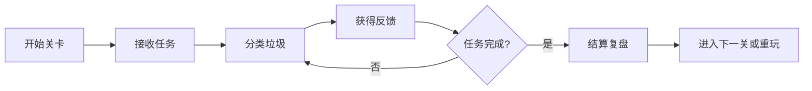

# 游戏机制模块

## 1. 模块定位

游戏机制模块负责定义项目如何从一次简单操作变成完整小游戏，包括任务目标、倒计时、得分、连击、关卡、难度、成就和复盘。它的作用是提升参与感和重复练习意愿。

本项目的游戏机制应服务环保教育，不应让玩家只追求速度和分数。机制的核心是让用户在轻度挑战中反复练习分类判断。

## 2. 设计目标

- 建立清晰的任务目标和完成条件。
- 用计时、得分和连击提升参与感。
- 用难度分级逐步引入复杂垃圾。
- 用复盘机制强化学习效果。
- 用成就系统增强完成后的积极感受。

## 3. 基础游戏循环

## 4. 任务机制

每轮任务包含：

- 目标数量：例如完成 12 件垃圾分类。
- 时间限制：例如 180 秒。
- 胜利条件：目标垃圾全部正确处理，或在允许错误次数内完成任务。
- 失败条件：时间耗尽，或错误次数超过设定值。

教学关可取消失败惩罚，正式关再加入倒计时和评分。

## 5. 得分机制

| 行为 | 分数规则 |
| --- | --- |
| 正确投放 | 增加基础分 |
| 连续正确 | 额外增加连击分 |
| 快速正确 | 可增加少量时间奖励 |
| 错误投放 | 不加分，记录错误 |
| 重试成功 | 给基础分，但不计入连击 |

得分不是唯一目标，结算页应同时展示正确率和错误复盘，避免用户只关注速度。

## 6. 难度机制

| 难度 | 垃圾类型 | 提示强度 | 目标 |
| --- | --- | --- | --- |
| 教学 | 一眼可辨垃圾 | 强提示 | 学会操作 |
| 简单 | 常见四分类垃圾 | 中提示 | 建立基础分类概念 |
| 普通 | 多场景日常垃圾 | 弱提示 | 独立完成分类 |
| 挑战 | 易混淆垃圾 | 仅错误解释 | 训练真实判断能力 |

难度提升不应只增加数量，也应增加判断复杂度。

## 7. 成就机制

可设计轻量成就：

- “分类新手”：完成教学关。
- “低碳达人”：单轮正确率达到 90%。
- “连续判断王”：连续正确 10 次。
- “有害垃圾守护者”：有害垃圾全投对。
- “社区环保官”：完成社区场景挑战。

成就主要用于正向鼓励，不需要复杂养成系统。

## 8. 复盘机制

复盘是本项目教育价值的重要部分。每轮结束后，系统应展示：

- 用户分错的垃圾。
- 用户投到哪个错误类别。
- 正确类别是什么。
- 为什么这样分类。
- 是否进入针对错误物品的复盘关。

复盘关可以只出现用户刚才分错的物品，帮助用户再次练习。

## 9. 混元建模与游戏资产描述

游戏机制模块涉及的建模资产主要是关卡标识、成就徽章、奖励图标和复盘展示道具。这些资产应轻量、符号化，服务游戏反馈，不需要复杂动画。

### 9.1 关卡标识资产

| 资产 | 建模描述 | 用途 |
| --- | --- | --- |
| 教学关标识 | 绿色圆形牌，带书本或问号图标 | 表示新手教学 |
| 基础关标识 | 蓝色圆形牌，带垃圾桶图标 | 表示基础分类 |
| 挑战关标识 | 橙色或黄色圆形牌，带计时器图标 | 表示限时挑战 |
| 复盘关标识 | 紫色或蓝绿色圆形牌，带回转箭头图标 | 表示错误复盘 |

### 9.2 成就徽章资产

| 成就 | 建模描述 |
| --- | --- |
| 分类新手 | 小奖章形状，中间是四分类垃圾桶图案 |
| 低碳达人 | 绿色叶片和星星组合的圆形徽章 |
| 连续判断王 | 带数字连击区域和闪光边框的徽章 |
| 有害垃圾守护者 | 红色盾牌加警示符号，表现正确处理危险垃圾 |
| 社区环保官 | 社区房屋轮廓加环保叶片的徽章 |

### 9.3 复盘展示道具

建模描述：

- 一个悬浮展示台或小型桌面，用于摆放用户分错的垃圾。
- 展示台可带 3-5 个浅色格子，每个格子放一个错误物品。
- 格子旁边预留文字区域，具体解释由 Unity UI 添加。
- 风格干净、教学感强，不要像惩罚界面。

### 9.4 奖励表现资产

- 星星粒子或星形小模型：用于正确投放和结算奖励。
- 分数牌：小型悬浮数字牌，显示 `+10`、`+20` 等。
- 时间奖励图标：小钟表加绿色加号。
- 完成标识：大号对勾或“任务完成”标牌。

## 10. 与其他模块的关系

| 关联模块 | 对接内容 |
| --- | --- |
| 场景设计 | 不同关卡对应不同场景 |
| 垃圾物品设计 | 难度由垃圾物品复杂度决定 |
| 分类规则 | 判断结果影响得分和胜负 |
| 反馈设计 | 得分、连击和成就需要反馈表现 |
| UI 与引导 | 展示倒计时、进度、结算 |
| 数据评估 | 记录关卡结果和学习效果 |

## 11. 验收标准

- 玩家能明确知道本轮任务目标。
- 游戏至少包含目标数量、倒计时和胜负结算。
- 得分规则简单易懂。
- 难度能从简单垃圾逐步过渡到易混淆垃圾。
- 复盘能展示用户真实错误。
- 游戏机制增强学习动力，而不是干扰分类判断。
